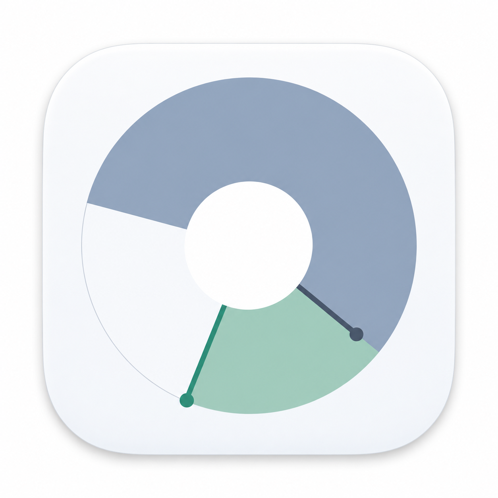

# Thymer



[English](README.md) · [中文](README.zh.md)

> “Know Thy Time” — Peter F. Drucker, *The Effective Executive* ([excerpt](https://www.christianitytoday.com/pastors/content/knowthytime/))

**Thymer** sounds like *timer*, with *thy* borrowed from “Know Thy Time”: first understand where your time goes, then decide how to use it.

A small **macOS menu-bar timer** for work, rest, and a record of your day. Set a cycle, name what you’re doing, and let it keep track—without adding up start and end times by hand.

Ideas or feedback? [Open an issue](https://github.com/simonsysun/thymer/issues) or join an existing conversation.

## What it does

- **Set time with a dial.** Drag the hands to adjust Work and Rest, including rest-only sessions.
- **Stay in control.** Start, pause, resume, or restart. A brief notice marks each start and resume.
- **See where today went.** Named tasks and a timeline show your work and breaks.
- **Keep it local.** Records stay on your Mac. No account, server, or analytics.

## Try it

**[Download v0.1.0-beta.1 for Apple Silicon](https://github.com/simonsysun/thymer/releases/download/v0.1.0-beta.1/Thymer-v0.1.0-beta.1-macos-arm64.zip)** · [Release notes & checksums](https://github.com/simonsysun/thymer/releases/tag/v0.1.0-beta.1#user-content-english)

An early public beta for **macOS 26+**. Unzip, move `Thymer.app` to Applications, and open it. Quit an older copy before replacing it; existing records are kept.

Build on **macOS 26+** with Xcode 26 command-line tools and Python 3:

```sh
./scripts/build.sh
open 'dist/Thymer.app'
```

The download supports Apple Silicon and macOS 26+. Builds are ad-hoc signed and intentionally not notarized; first launch may require **Open Anyway** in System Settings → Privacy & Security. See the [build and recording guide](NATIVE.md) for setup, controls, and current limitations.

## Looking ahead

- **Mobile:** keep track of time away from the desk.
- **AI agents:** set timers, adjust cycles, and review your time in natural language.
- **More platforms:** bring the same simple workflow to other operating systems.

These are future directions, not features in the current app. Plans will evolve with feedback.

## License

[MIT](LICENSE). Use it, change it, and share what you make.
