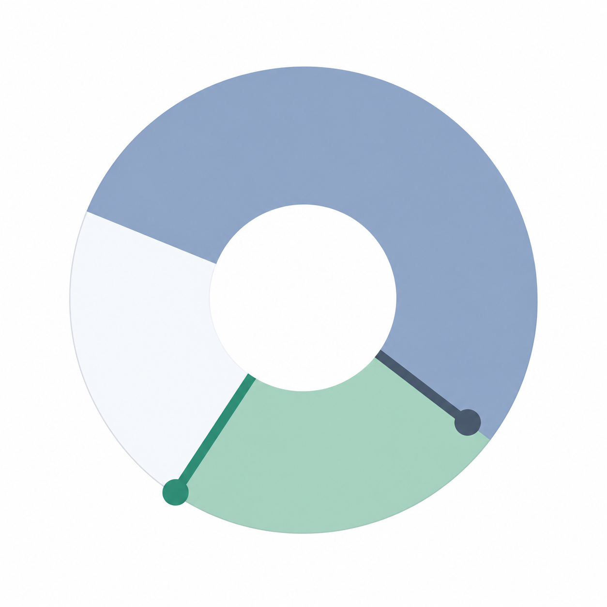

# Thymer logo exploration

Current application artwork: [approved app icon](app-icon/README.md), included in the macOS build. The materials below preserve the earlier design exploration.

- [Design document](logo-design.md)
- [Independent product-aware logo review](logo-design-review.md)
- [Exact generation prompt](logo-generation-prompt.txt)
- [Three-sector concept](concepts/thymer-three-sectors-v1.png)

Created with built-in imagegen from the owner's selected complete-dial reference.
This is a concept, not an installed icon or a precision vector master. It retains
visible tonal variation; flat-color production cleanup and small-size adaptation
are not claimed as complete. No application files or installed build were changed.

## Editable vector stage

[Inkscape-compatible SVG and size previews](vector/README.md) now implement the reviewed geometry with flat fills. The application is open on this SVG. Small-size adaptation and owner selection remain separate from construction accuracy.
